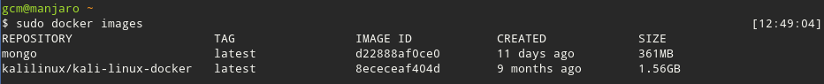

## Virtualización ligera usando contenedores

Un buen tutorial de uso de Docker se encuentra en 
[link](https://rootsudo.wordpress.com/2016/06/29/docker-manual-en-espanol/)

### **Ejercicio 3**: Instalar docker

Para instalar docker en *Arch Linux*,  basta con lanzar
`sudo pacman -S docker`
Tras esto, docker queda instalado. Ahora debemos iniciar el servicio y añadirlo al inicio del sistema:
`sudo systemctl start docker`
`sudo systemctl enable docker`

Al trabajar con Docker, se debe hacer como root. Podemos evitarlo con:
`sudo usermod -aG docker $USER`
`newgrp docker`

### **Ejercicio 4**
####  1. Instalar a partir de docker una imagen alternativa de Ubuntu y alguna adicional, por ejemplo de CentOS. 
####  2.Buscar e instalar una imagen que incluya MongoDB.

1. En esta parte del ejercicio, instalaré la imagen de [Kali Linux](https://hub.docker.com/r/kalilinux/kali-linux-docker/). 

   `docker pull kalilinux/kali-linux-docker`
1. Y aquí instalaré la imagen de [Mongo](https://hub.docker.com/_/mongo/) mediante:

   `docker pull mongo`
   

     
### **Ejercicio 5**
Puesto que he instalado la imagen de *Kali Linuxi*, instalaré una herramienta propia de la distro, como puede ser el escáner *Arachni*. Antes de ello debo hacer un update en la imagen para actualizar los repositorios.
`apt update && apt install arachni`
Hay una gran cantidad de paquetes que necesitan actualización, ya que la imagen fue creada hace 9 meses. No los actualizaremos ahora mismo, sino en el **ejercicio 6**. Esto lo hacemos porque, la sesión creada es temporal, y todos los cambios se perderán.

### **Ejercicio 6**
En este ejercicio voy a crear una imagen actualizada de *Kali Linux* con algunas aplicaciones instaladas.

