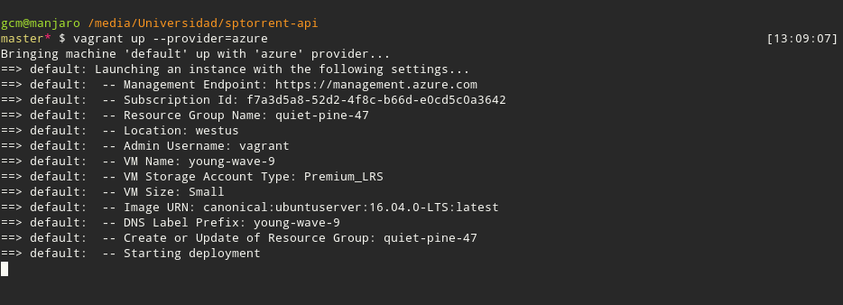

## Hito 5º: Diseño del soporte virtual para el despliegue de una aplicación

En primera instancia, hay que destacar que se empleará **Azure** como *IaaS*. Por ello, *azure-cli* debe ser instalado en el sistema para poder administrarlo cómodamente.

###  Vagrant: creación de máquinas virtuales
**Vagrant** es un sistema que permite montar entornos fácilmente replicables y configurables. Además permite desplegarlas en AWS o Azure de forma sencilla.

He decidido utilizar Vagrant por la gran cantidad de [recursos disponibles](https://github.com/Azure/vagrant-azure) en la red. Por otra parte, al funcionar con *Ruby*, se hace más fácil y cómodo su uso.

Una vez instalado Vagrant, se deben instalar el plugin de Azure: 
`vagrant plugin install vagrant-azure`

En el directorio raíz se ejecuta `vagrant init`, creando un *Vagrantfile* que será editado a continuación. En él añadiremos la instalación del plugin y la configuración de Azure.

Debemos obtener los datos de nuestra cuenta. Necesitamos poner Azure en modo **asm:**
`azure config mode asm`

Descargamos los detalles de nuestra cuenta y los importamos a Azure
`azure account download`
`azure account import datos.publishsettings`

A continuación se debe crear una aplicación con el siguiente comando, obteniendo información personal para posteriormente establecer en nuestro **VagrantFile** o establecerlas como variables de entorno.
`az ad sp create-for-rbac`
`az account list`

Finalmente editamos [Vagrantfile](https://github.com/patamimbre/sptorrent-api/blob/master/Vagrantfile) como se muestra en el enlace.

Para ejecutar Vagrant con nuestro Vagrantfile basta con posicionarse en la carpeta donde se encuentre el archivo y ejecutar `vagrant up --provider=azure`

Si lo que queremos es conectar por ssh a la máquina basta con lanzar
`vagrant ssh`

### Ansible: configuración de máquina virtual
### Capistrano: despliegue y ejecución
