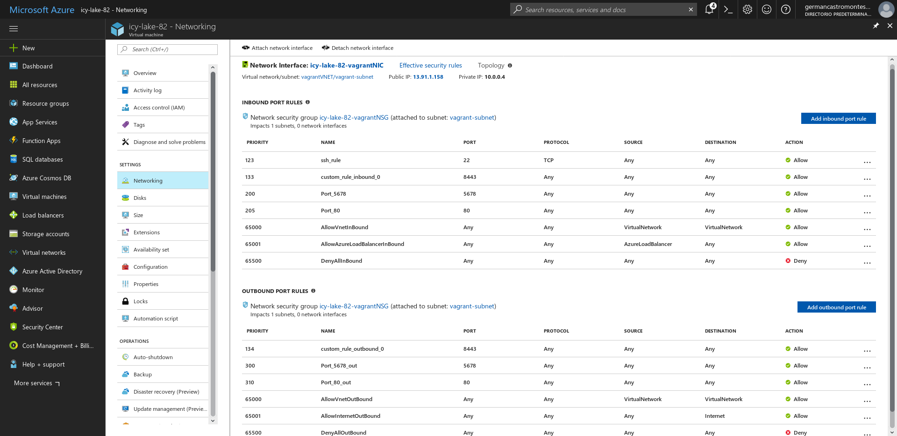

## Hito 5º: Diseño del soporte virtual para el despliegue de una aplicación

En primera instancia, hay que destacar que se empleará **Azure** como *IaaS*. Por ello, *azure-cli* debe ser instalado en el sistema para poder administrarlo cómodamente.

###  Vagrant: creación de máquinas virtuales
**Vagrant** es un sistema que permite montar entornos fácilmente replicables y configurables. Además permite desplegarlas en AWS o Azure de forma sencilla.

He decidido utilizar Vagrant por la gran cantidad de [recursos disponibles](https://github.com/Azure/vagrant-azure) en la red. Por otra parte, al funcionar con *Ruby*, se hace más fácil y cómodo su uso.

Una vez instalado Vagrant, se deben instalar el plugin de Azure: 
`vagrant plugin install vagrant-azure`

En el directorio raíz se ejecuta `vagrant init`, creando un *Vagrantfile* que será editado a continuación. En él añadiremos la instalación del plugin y la configuración de Azure.

Debemos obtener los datos de nuestra cuenta. Necesitamos poner Azure en modo **asm:**
`azure config mode asm`

Descargamos los detalles de nuestra cuenta y los importamos a Azure
`azure account download`
`azure account import datos.publishsettings`

A continuación se debe crear una aplicación con el siguiente comando, obteniendo información personal para posteriormente establecer en nuestro **VagrantFile** o establecerlas como variables de entorno.
`az ad sp create-for-rbac`
`az account list`

Finalmente editamos [Vagrantfile](https://github.com/patamimbre/sptorrent-api/blob/master/Vagrantfile) como se muestra en el enlace.

Para ejecutar Vagrant con nuestro Vagrantfile basta con posicionarse en la carpeta donde se encuentre el archivo y ejecutar `vagrant up --provider=azure`


Si lo que queremos es conectar por ssh a la máquina basta con lanzar
`vagrant ssh`


### Ansible: configuración de máquina virtual
Ansible resulta realmente útil a la hora de provisionar la máquina virtual. Tras la ejecución de Vagrant, se lanzará ansible utilizando el [playbook.yml](https://github.com/patamimbre/sptorrent-api/blob/master/provision/playbook.yml) indicado.

La mayoría de compañeros han realizado esta parte de forma distinta a mi. En su caso, **con Ansible han realizado las mismas instalaciones que en su Dockerfile**. Yo he ido un paso más allá, y aprovechando este fichero he decidido instalar *docker, docker-compose y mongodb* y así poder correr directamente el contenedor.

```ruby
---
- hosts: all
  sudo: yes
  tasks:
  - name: Install docker apt key
    apt_key:
      keyserver: hkp://ha.pool.sks-keyservers.net:80
      id: 58118E89F3A912897C070ADBF76221572C52609D

  - name: Install docker repo
    apt_repository:
      repo: "deb https://apt.dockerproject.org/repo ubuntu-xenial main"

  - name: Install mongodb apt key
    apt_key:
      keyserver: hkp://keyserver.ubuntu.com:80
      id: EA312927

  - name: Install mongodb repo
    apt_repository:
      repo: "deb http://repo.mongodb.org/apt/ubuntu xenial/mongodb-org/3.2 multiverse"

  - name: Install latest version of "docker" and "mongodb" ignoring "install-recommends"
    apt:
      name: "{{ item.name }}"
      state: latest
      install_recommends: no
    with_items:
      - { name: 'linux-image-extra-4.4.0-57-generic' }
      - { name: 'linux-image-extra-virtual' }
      - { name: 'docker-engine' }
      - { name: 'python-setuptools' }
      - { name: 'python-pkg-resources' }
      - { name: 'python-pip' }
      - { name: 'mongodb-org' }

  - name: Upgrade pip
    pip:
      name: pip
      extra_args: --upgrade

  - name: Install docker-compose
    pip:
      name: docker-compose

  - name: Start mongodb service
    service:
      name: mongod
      state: started
```


### Fabric: despliegue de la aplicación

Fabric permite desplegar de forma sencilla la aplicación mediante funciones escritas en python. Para el despliegue únicamente he necesitado 4 funciones básicas.
1. **Install**: Instalar descargando el repositorio.
2. **Uninstall**:Eliminar el directorio de la app.
3. **Start**:Lanzar docker-compose.
4. **Stop**:Detener los contenedores en ejecución.
En el archivo [fabfile.py](https://github.com/patamimbre/sptorrent-api/blob/master/despliegue/fabfile.py) se puede encontrar el código de las cuatro funciones descritas.

Para poder ejecutar un fabfile, **es necesario instalarlo** mediante
`pip install fabric`

Y ejecutar la siguiente orden en el directorio raiz del repositorio
`fab -H vagrant@<ip> -f despliegue/fabfile.py <funcion>`

Por ejemplo, para crear los contenedores y echar a andar la aplicación:
`fab -H vagrant@floral-tree-92.westus.cloudapp.azure.com -f despliegue/fabfile.py Start`

### Notas
Vagrantfile ofrece una opción con la que abrir los puertos de nuestra máquina virtual en Azure. En mi caso no he conseguido que funcione de forma correcta, así que es necesario abrir los puertos manualmente como se muestra en la siguiente imagen.

