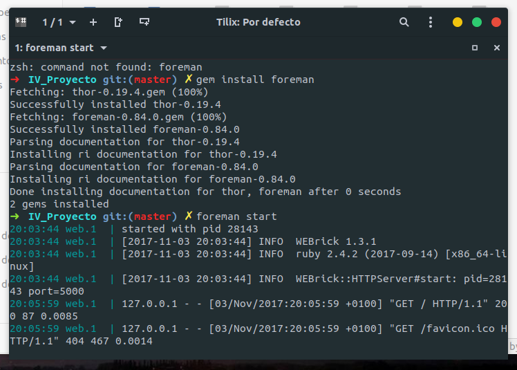
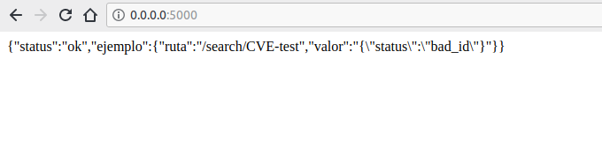
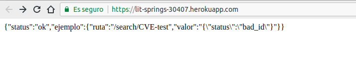
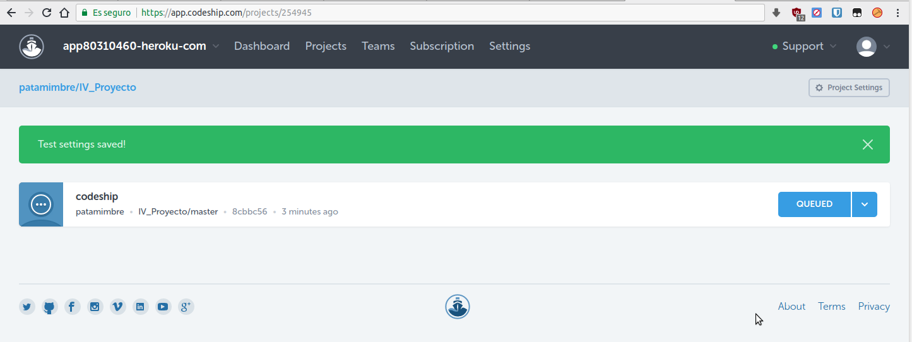
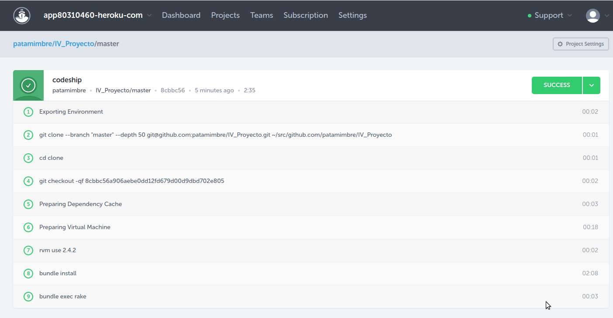

## Infraestructura Virtual - PaaS

#### 1. Darse de alta en algún servicio PaaS tal como Heroku, zeit, BlueMix u OpenShift.
Se ha decidido usar Heroku como servicio PaaS. El primer paso es [registrarse](https://signup.heroku.com/login).
A continuación una vez iniciada sesión, aparecerá la página principal donde se podrá comenzar
a desarrollar aplicaciones. También se ofrecen guías para distintos lenguajes de programación.


#### 2. Crear una aplicación en OpenShift o en algún otro PaaS en el que se haya dado uno de alta. Realizar un despliegue de prueba usando alguno de los ejemplos incluidos con el PaaS.

Según la [guía oficial](https://devcenter.heroku.com/articles/getting-started-with-ruby) de Heroku para Ruby, lo primero es instalar **Heroku CLI** y entrar con nuestras credenciales. A continuación se debe clonar el repositorio donde estará el esqueleto de la aplicación.


A continuación se procede a desplegar la aplicación. Para lograrlo, se debe ejecutar:

`heroku create`

`git push heroku master `

Tras esto, la aplicación estará desplegada. Para abrirla procedemos con

`heroku open`


¡Bien! La aplicación de prueba ya se encuentra desplegada.


#### 3. Realizar una app en express (o el lenguaje y marco elegido) que incluya variables como en el caso anterior.

Al usar **Ruby** como lenguaje, contamos con el framework [**Sinatra**](http://www.sinatrarb.com/) para desarrollar interfaces REST de forma relativamente sencilla. El primer paso es instalarlo mediante `gem install sinatra thin`.

A continuación se procede a desarrollar una aplicación simple que trabaje con *Sinatra*, apoyandonos en la [documentación oficial](http://www.sinatrarb.com/intro-es.html).


La aplicación básica que he programado consiste en un reproductor embebido en la página web (para la ruta *get*) y un uploader (para la ruta *put*). Su código es así de sencillo: 

En **ejercicio3.rb**: 

```ruby
require 'sinatra'

get '/' do
  "Hola, accede a /video para ver el ejemplo.
  \nSi quieres subir un archivo (PUT) hazlo mediante \n
  curl -v --location --upload-file file.txt http://localhost:4567/upload/"
end

get '/video' do
  File.read(File.join('.','index.html'))
end

put '/upload/:id' do
    File.open(params[:id],'w+') do |file|
      file.write(request.body.read)
    end
end
```

Y en **index.html**:

```html
<!DOCTYPE html>
<html lang="en">
    <head>
        <meta charset="utf-8">
        <title>HTTP Live Streaming Example</title>
        <link href="http://vjs.zencdn.net/c/video-js.css" rel="stylesheet">
        <script src="http://vjs.zencdn.net/c/video.js"></script>
    </head>
    <body>
    <video class="video-js vjs-default-skin"
       controls preload="auto" width="1280" height="720"
       data-setup='{"example_option":true}'>
   <source src="http://techslides.com/demos/sample-videos/small.mp4" type='video/mp4'/ >
     </video>
    </body>
</html>
```

Tras esto, se puede ver como la aplicación funciona correctamente y de forma extremadamente sencilla

#### Ejemplo video


#### Ejemplo uploader


#### 4. Crear pruebas para las diferentes rutas de la aplicación

A la hora de realizar el ejercicio, he desarrollado el API REST enfocado a mi proyecto. A falta del despliegue de la BD por parte de mi compañero, muestro la funcionalidad básica de este, definiendo las rutas. 

``` ruby
require 'sinatra'

get '/' do
  {'status' => 'ok',
   'ejemplo' =>
       {'ruta' => "/search/CVE-test",
        'valor' => {'status'=>'bad_id'}.to_json
       }}.to_json
end

get '/search/:id' do |id|
  if id !~ /\ACVE-\d{4}-\d{4}\z/
    {'status' => 'bad_id'}.to_json

  else

    # buscar cve en DB y devolver json
    "CVE -> #{id}"

  end
end

get '/service/:service' do |s|

  # buscar cves en db por nombre de servicio
  "Servicio -> #{s}"
end


```

#### 5. Instalar y echar a andar tu primera aplicación en Heroku.

El primer paso, antes de ser desplegada, es **crear el spec y rake** correspondiente a aplicación desarrollada. Puesto que no puedo testear correctamente los *json* recibidos, únicamente se comprobará que la ruta devuelva un *status 200 OK*

```ruby
# spec/api_rest_spec.rb

require 'rspec'
require 'rack/test'
require File.expand_path '../../lib/api_rest.rb', __FILE__

describe "API REST" do

  include Rack::Test::Methods
La aplicación se encuentra preparada para ser desplegada. 
  def app
    Sinatra::Application
  end

  context "GET to /" do

    it "displays json test"

    it "returns status 200 OK" do
      get '/'
      expect(last_response).to be_ok
    end
  end

  context "GET to /search/:id" do

    it "returns status 200 OK" do
      get '/search/CVE-2009-3800'
      expect(last_response).to be_ok
    end

    it "displays cve info"
  end

  context "GET to /service/:service" do

    it "returns status 200 OK" do
      get '/service/asd'
      expect(last_response).to be_ok
    end

    it "displays cves of service"
  end


end
```


La aplicación se encuentra preparada para ser desplegada. Anteriormente ya se desplegó la aplicación de ejemplo. En este caso lo realizaré para la aplicación desarrollada para el proyecto. Para el desarrollo de este ejercicio me he basado en la [guía de sitepoint.com](https://www.sitepoint.com/get-started-with-sinatra-on-heroku/)

`heroku login`

`heroku create`

A continuación se debe crear **config.ru** y añadir:

``` ruby
require './lib/api_rest.rb'
run Sinatra::Application
```

Para comprobar el buen funcionamiento basta con ejecutar 

`rackup config.ru` 

y acceder a la url que proporciona. En mi caso lo he hecho y funciona correctamente.

También se debe crear el archivo **Procfile** con:

`web: bundle exec rackup config.ru -p $PORT`


#### 6. Usar como base la aplicación de ejemplo de heroku y combinarla con la aplicación en node que se ha creado anteriormente. Probarla de forma local con foreman. Al final de cada modificación, los tests tendrán que funcionar correctamente; cuando se pasen los tests, se puede volver a desplegar en heroku.

Antes de realizar algún paso, se debe instalar *foreman* mediante: 

`gem install foreman`

Una vez instalado, se comprobará el funcionamiento en local de la aplicación:

`foreman start`

En mi caso funciona correctamente, como se observa a continuación





Finalmente, se debe hacer hacer un push y completarlo sin obtener errores. En mi caso he obtenido un error relacionado con *Gemfile.lock*, solucionado volviendo a ejecutar *bundler install*.

`git push heroku master`

La app se encuentra funcionando en la url indicada tras hacer el push. En mi caso es [](https://lit-springs-30407.herokuapp.com/) y, como se muestra a continuación, está finalmente desplegada.



#### 7. Haz alguna modificación a tu aplicación para Heroku, sin olvidar añadir los tests para la nueva funcionalidad, y configura el despliegue automático a Heroku usando Snap CI

Puesto que Snap CI ha dejado de desarrollarse, he decidido usar **Codeship CI** para el despliegue automático. En el [devcenter de Heroku](https://devcenter.heroku.com/articles/codeship) se muestra un tutorial de instalación y uso de codeship.

`heroku addons:create codeship:free`

`heroku addons:open codeship`

A continuación se abre una página web donde configurar el proyecto, estableciendo los comandos de setup. En el caso de **Ruby** los más significativos son *rvm use 2.4.2*,*bundle install* y *bundle exec rake*

Una vez configurado, se debe hacer un push a nuestro repositorio y en codeship veremos los resultados.


