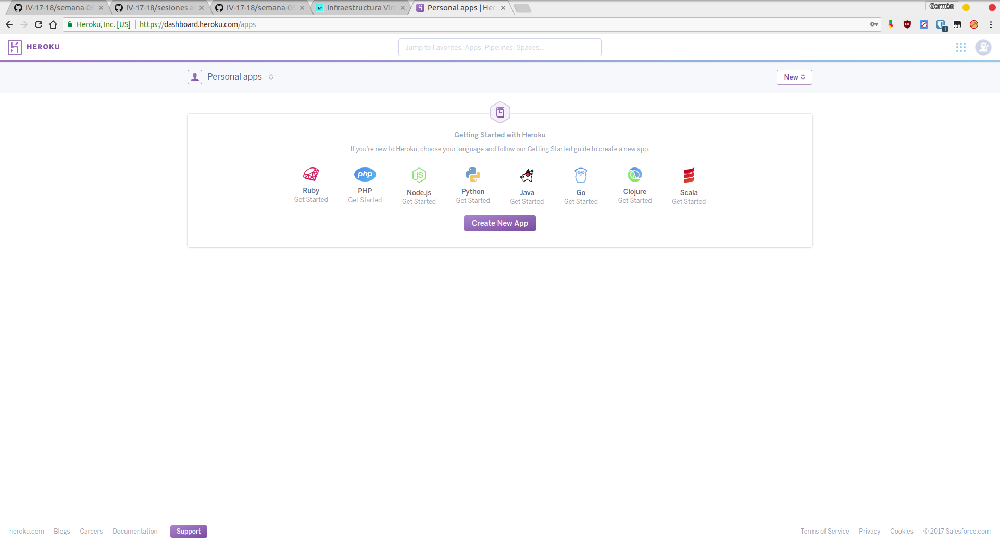
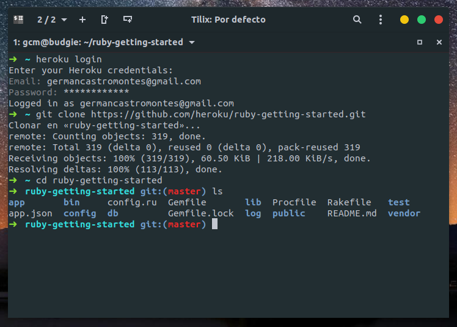
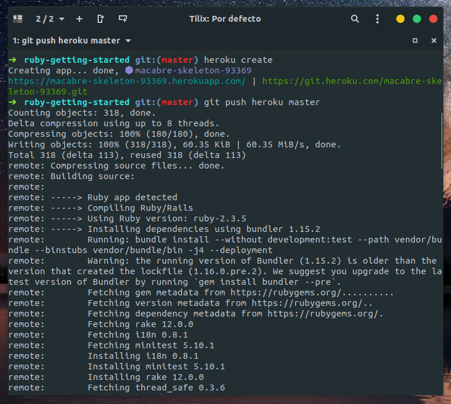
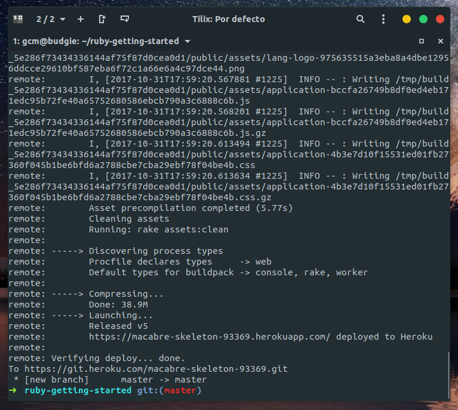
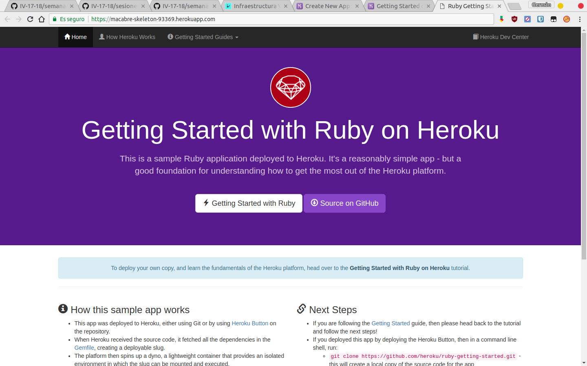
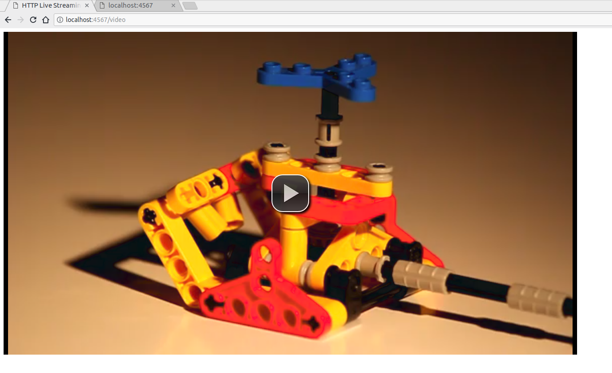
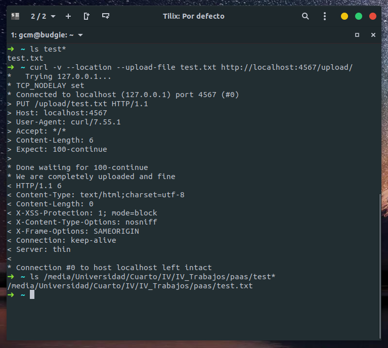

## Infraestructura Virtual - PaaS

#### 1. Darse de alta en algún servicio PaaS tal como Heroku, zeit, BlueMix u OpenShift.
Se ha decidido usar Heroku como servicio PaaS. El primer paso es [registrarse](https://signup.heroku.com/login).
A continuación una vez iniciada sesión, aparecerá la página principal donde se podrá comenzar
a desarrollar aplicaciones. También se ofrecen guías para distintos lenguajes de programación.



#### 2. Crear una aplicación en OpenShift o en algún otro PaaS en el que se haya dado uno de alta. Realizar un despliegue de prueba usando alguno de los ejemplos incluidos con el PaaS.

Según la [guía oficial](https://devcenter.heroku.com/articles/getting-started-with-ruby) de Heroku para Ruby, lo primero es instalar **Heroku CLI** y entrar con nuestras credenciales. A continuación se debe clonar el repositorio donde estará el esqueleto de la aplicación.



A continuación se procede a desplegar la aplicación. Para lograrlo, se debe ejecutar:

`heroku create`

`git push heroku master `

Tras esto, la aplicación estará desplegada. Para abrirla procedemos con

`heroku open`








¡Bien! La aplicación de prueba ya se encuentra desplegada.


#### 3. Realizar una app en express (o el lenguaje y marco elegido) que incluya variables como en el caso anterior.

Al usar **Ruby** como lenguaje, contamos con el framework [**Sinatra**](http://www.sinatrarb.com/) para desarrollar interfaces REST de forma relativamente sencilla. El primer paso es instalarlo mediante `gem install sinatra thin`.

A continuación se procede a desarrollar una aplicación simple que trabaje con *Sinatra*, apoyandonos en la [documentación oficial](http://www.sinatrarb.com/intro-es.html).


La aplicación básica que he programado consiste en un reproductor embebido en la página web (para la ruta *get*) y un uploader (para la ruta *put*). Su código es así de sencillo: 

En **ejercicio3.rb**: 

```ruby
require 'sinatra'

get '/' do
  "Hola, accede a /video para ver el ejemplo.
  \nSi quieres subir un archivo (PUT) hazlo mediante \n
  curl -v --location --upload-file file.txt http://localhost:4567/upload/"
end

get '/video' do
  File.read(File.join('.','index.html'))
end

put '/upload/:id' do
    File.open(params[:id],'w+') do |file|
      file.write(request.body.read)
    end
end
```

Y en **index.html**:

```html
<!DOCTYPE html>
<html lang="en">
    <head>
        <meta charset="utf-8">
        <title>HTTP Live Streaming Example</title>
        <link href="http://vjs.zencdn.net/c/video-js.css" rel="stylesheet">
        <script src="http://vjs.zencdn.net/c/video.js"></script>
    </head>
    <body>
    <video class="video-js vjs-default-skin"
       controls preload="auto" width="1280" height="720"
       data-setup='{"example_option":true}'>
   <source src="http://techslides.com/demos/sample-videos/small.mp4" type='video/mp4'/ >
     </video>
    </body>
</html>
```

Tras esto, se puede ver como la aplicación funciona correctamente y de forma extremadamente sencilla

#### Ejemplo video



#### Ejemplo uploader



